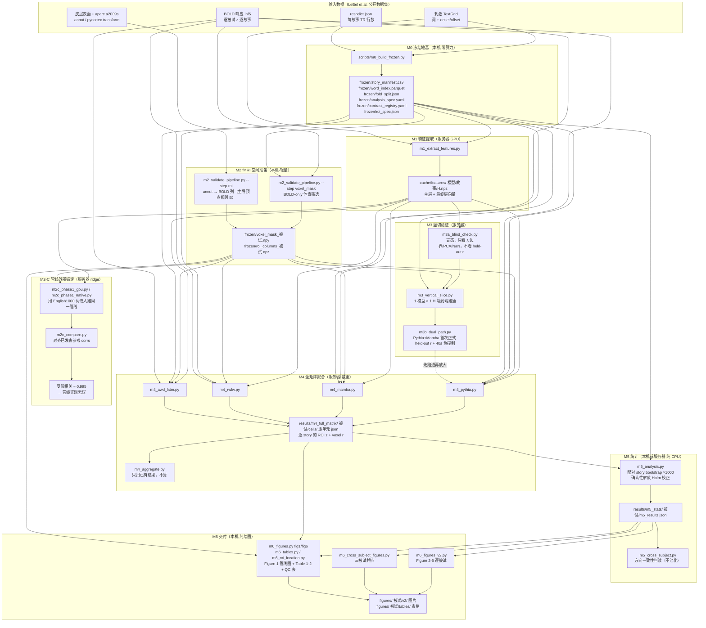
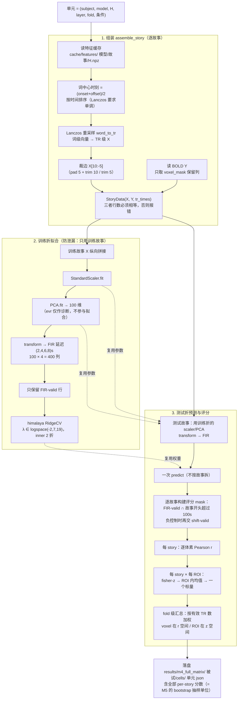
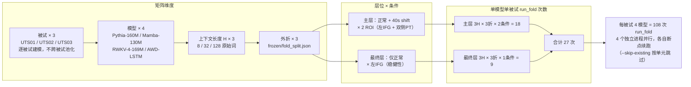
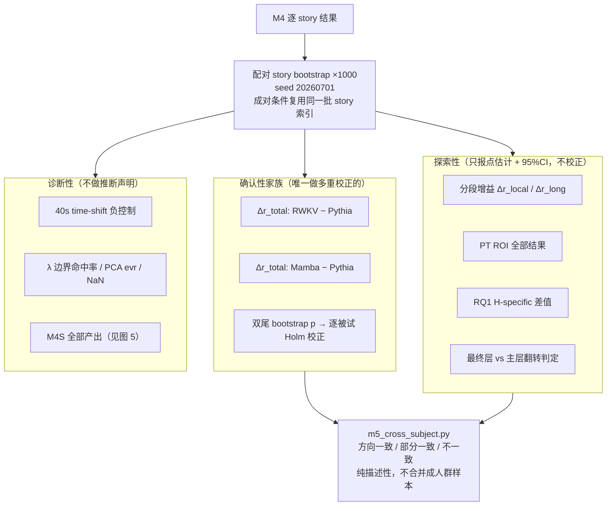
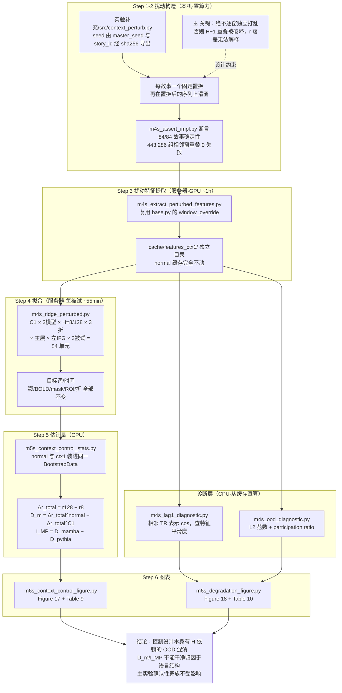
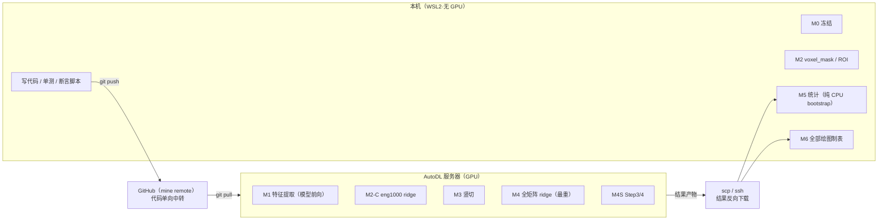

# 项目运行流程图

> 本文档只描述**项目实际是怎么跑的**（脚本、数据流、算力位置），不引入任何新设计。
> 所有节点名对应仓库里真实存在的脚本/目录/常量。

---

## 图 1 — 总览：一次完整实验从数据到论文图表



**关键点**

- `frozen/` 是全流程的**唯一真相源**：故事清单、词索引、三折划分、ROI 规则、分析参数在 M0/M2 一次性冻结，之后任何一步都只读不改。
- M2-C 是一条**旁路验证**：拿 English1000 走完全相同的 assemble→PCA→FIR→ridge，与已发表结果对齐到 0.995，用来证明"管线本身没写错"，然后才敢相信 M4 的模型比较结果。
- M3 是"先竖切再铺开"：M3a 盲态查参数 → M3 单模型端到端 → M3b 双模型 + 负控制，全部通过后才展开 M4 全矩阵。
- M5/M6 **不重跑任何模型推理或 ridge**，只读 M4 落盘的逐 story 结果。

---

## 图 2 — 单个矩阵单元内部：一次 `run_fold` 到底做了什么

这是整个项目的计算核心（[src/ridge/pipeline.py](../src/ridge/pipeline.py) 的 `run_fold`）。



**三条不可违反的纪律都在这张图里**

1. **无泄漏**：scaler / PCA / λ 全部只在该折的训练故事上 fit，测试故事只 transform。
2. **story 级评分**：拟合和预测是整折一次完成的，只有**评分**按故事切片——因为 M5 的 bootstrap 单位是 story，必须保留 per-story 分数。
3. **ROI 聚合顺序固定**：在 story 级完成 fisher-z→ROI 均值，绝不从 fold 级 voxel r 反推（两种加权顺序不等价）。

---

## 图 3 — M4 矩阵怎么展开的（规模来源）



`m4_pythia.py` / `m4_mamba.py` / `m4_rwkv.py` / `m4_awd_lstm.py` 是四个**独立入口**，共享
[src/ridge/m4_driver.py](../src/ridge/m4_driver.py)。拆成四个进程是为了能用不同 GPU / 终端分别启动、
互不阻塞、单独重跑；`m4_aggregate.py` 只扫盘不算，可在任何时候查进度（缺失单元会列在 manifest 里）。

---

## 图 4 — 统计口径分层（M5 最容易搞错的地方）



**红线**：三名被试**从不池化**，不产出任何组水平 CI。跨被试的说服力来自"同一效应在三个人身上独立重现"，
而不是合并后的显著性。

---

## 图 5 — 补充实验支线 M4S：刺激侧上下文控制（C1）

导师建议的控制实验（[实验补充/](../实验补充/)），检验 Context Gain 是否真依赖语言历史，
而非只是"输入更长/特征更平滑/故事位置效应"。



完整结果数字见 [实验补充/结果总记录.md](../实验补充/结果总记录.md)（权威记录）。

---

## 图 6 — 本机 / 服务器职责划分（算力约束）



**约束**：任何模型推理 / ridge 拟合都不在本机跑，且需明确确认后才启动。
每次 push 后必须完成两步——本地确认推送成功 + 服务器 `git pull` 后再重跑，不能假定服务器已是最新代码。

---

## 与论文 Figure 1 的关系（别搞混）

项目里**已经有一张流程图**：`figures/{被试}/fig1_pipeline.png`，由
[scripts/m6_figures.py](../scripts/m6_figures.py) 的 `fig1()` 生成（v2 脚本不含 fig1，只产 fig2–fig5）。
两者视角不同，互补而非重复：

| | 论文 Figure 1 (`fig1_pipeline`) | 本文档 |
|---|---|---|
| 读者 | 论文审阅人 / 答辩老师 | 自己、接手代码的人 |
| 内容 | 7 步**方法**管线：词索引 → 特征 → Lanczos+FIR → 训练折内变换 → RidgeCV → story 级评分 → 3 折汇总 | 里程碑编排、脚本名、冻结产物、算力位置、统计口径分层 |
| 语言 / 形式 | 英文、matplotlib 竖排单链 | 中文、mermaid 多视图 |
| 是否含里程碑 | 不含（论文不谈 M0-M6） | 含 |

本文档的**图 2** 是 Figure 1 的展开版——同一条管线，但补上了防泄漏的参数复用关系、
评分 mask 的三重交集、以及 ROI 聚合顺序这些图里放不下的实现细节。答辩若被问
"你这条管线怎么保证没泄漏"，看图 2 比看 Figure 1 更容易答。

---

## 一句话总结运行顺序

```
M0 冻结 → M2 空间准备 →（M2-C 旁路验证管线）→ M1 特征提取
   → M3a/M3/M3b 竖切通关 → M4 全矩阵 108×3 次拟合
   → M5 配对 bootstrap + Holm → M6 图表交付
                                    ↘ M4S 补充控制（C1 支线，诊断性）
```
